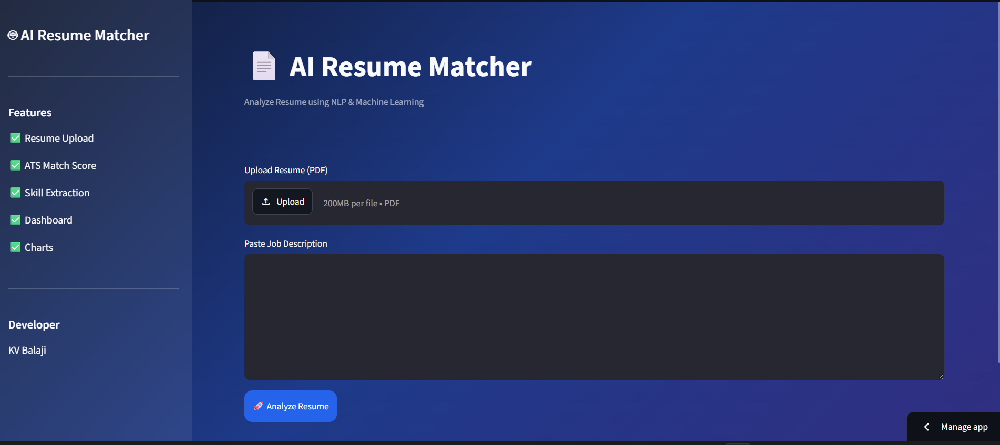
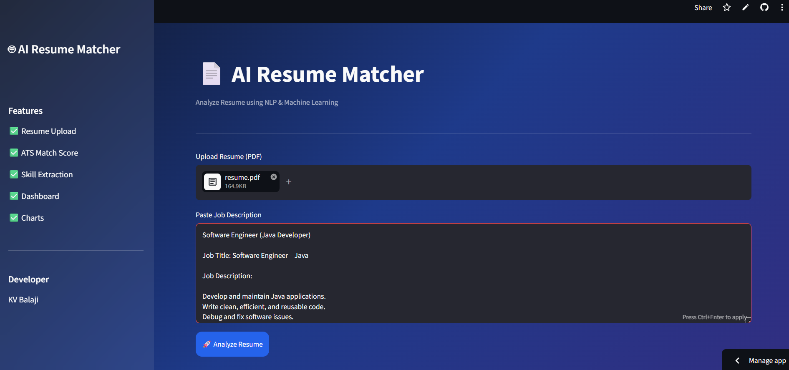
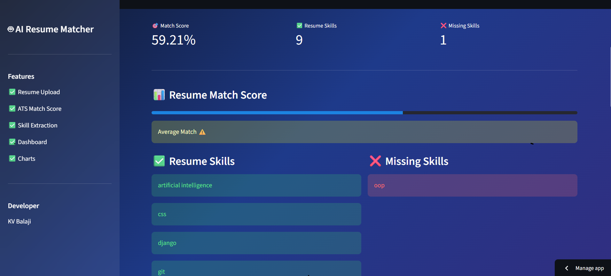
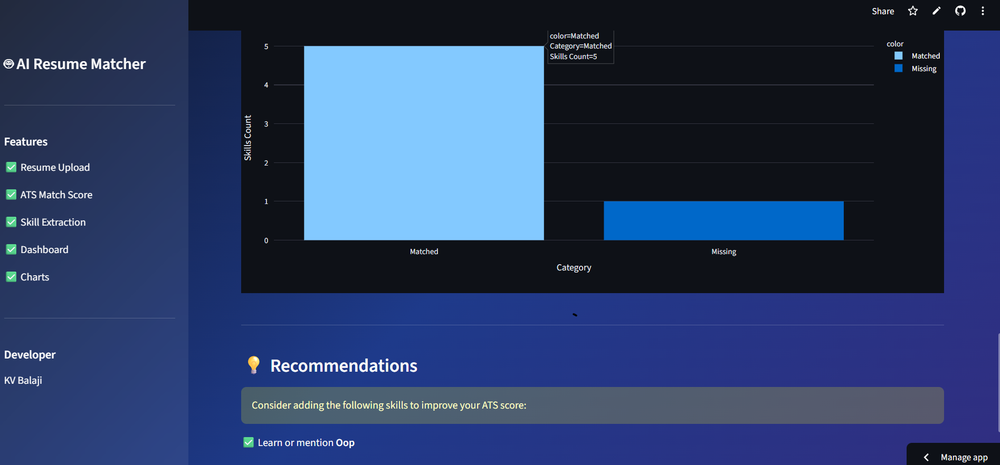

# 🤖 AI Resume Matcher

## 🌐 Live Demo

🔗 https://ai-resume-matcher-mi6raczeuisuwad6jswavf.streamlit.app/

An AI-powered Resume Screening application built using **Python**, **Streamlit**, and **BERT Semantic Matching**.

## 🚀 Features

- 📄 Upload Resume (PDF)
- 🤖 BERT Semantic Matching
- 📊 ATS Match Score
- 🛠 Skill Extraction
- 📈 Dashboard Cards
- 🥧 Pie Chart
- 📉 Bar Chart
- 💡 Resume Recommendations

## 🛠 Technologies Used

- Python
- Streamlit
- Sentence Transformers (BERT)
- Scikit-learn
- Plotly
- SpaCy

## 📂 Project Structure

```
JobResumeMatcher/
│── data/
│── utils/
│── streamlit_app.py
│── requirements.txt
│── README.md
│── .gitignore
```

## ▶️ Run the Project

```bash
pip install -r requirements.txt
streamlit run streamlit_app.py
```
## 📸 Screenshots

### 🏠 Home Page



### 📄 Resume Upload



### 📊 Analysis Result



### 📈 Dashboard



## 👨‍💻 Author

**KV Balaji**
